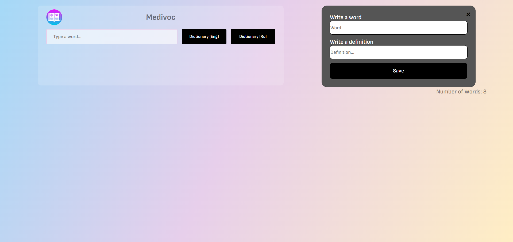

# 📘 Словарь на JavaScript

## 🚀 Используемые технологии


---



## ⚙️ Установка и запуск проекта

1. Склонируйте проект:
   ```bash
   git clone https://github.com/Alexander-Klem/Dictionary.git
2. Установите зависимости:
   ```bash
   npm install
3. Установите:
    * Node.js   
    * Open Server

## 🧰 Настройка через Open Server

1. Переместите папку проекта в директорию home:
    ```bash 
    OSPanel/home/Dictionary/
2. Запустите Open Server, включите PHP 7.4.
3. Откройте сайт по адресу:
    ```bash 
    http://dictionaryv1/

